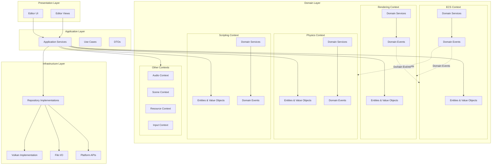

# Unity-Type Game Engine Architecture Plan

## Overview

This plan outlines the architecture for a full-featured game engine similar to Unity, built in C# with Vulkan rendering backend. The engine will support both 2D and 3D games, run cross-platform, and include C# scripting with hot-reload capabilities. Additionally, the engine will support a custom scripting language called "lag scripting" - a C#/TypeScript hybrid language using `.lag` file extensions.

The architecture follows **Domain-Driven Design (DDD)** principles, with clear separation between domain logic, application services, infrastructure, and presentation layers.

## DDD Architecture Overview

### Architecture Diagram



### Layer Dependencies

- **Presentation** → **Application** → **Domain**
- **Application** → **Infrastructure** (for technical implementations)
- **Domain** has no dependencies on other layers
- **Infrastructure** implements interfaces defined in Domain/Application

### Layered Architecture

The engine is structured in four main layers:

1. **Domain Layer**: Core business logic, entities, value objects, domain services, and domain events
2. **Application Layer**: Use cases, application services, DTOs, and orchestration
3. **Infrastructure Layer**: Technical implementations (Vulkan, file I/O, platform abstraction)
4. **Presentation Layer**: Editor UI and user interfaces

### Bounded Contexts

The engine is divided into the following bounded contexts, each with its own domain model:

- **ECS Context**: Entity-Component-System domain
- **Rendering Context**: Visual rendering and graphics
- **Physics Context**: Physics simulation and collision
- **Audio Context**: Sound and audio processing
- **Scripting Context**: Script compilation and execution
- **Scene Context**: Scene management and serialization
- **Resource Context**: Asset and resource management
- **Input Context**: User input handling

### Domain Concepts

**Entities**: Game objects with identity (Entity, GameObject, Component)

**Value Objects**: Immutable objects without identity (Vector3, Color, Matrix4x4, Transform)

**Aggregates**: Clusters of entities (Scene, Prefab)

**Domain Services**: Operations that don't fit in entities (RenderingPipeline, PhysicsSimulation)

**Repositories**: Abstraction for persistence (SceneRepository, AssetRepository)

**Application Services**: Orchestrate domain operations (SceneManagerService, RenderingService)

**Domain Events**: Events representing domain occurrences (EntityCreated, ComponentAdded, SceneLoaded)

## Core Architecture

### 1. Domain Layer - Core Foundation

**Domain Entities & Value Objects:**

- **Time** (`Engine/Domain/Core/Time.cs`): Value object representing time (delta time, fixed time)
- **ApplicationConfig** (`Engine/Domain/Core/ApplicationConfig.cs`): Value object for engine configuration
- **LogLevel** (`Engine/Domain/Core/LogLevel.cs`): Value object for log severity

**Domain Services:**

- **TimeService** (`Engine/Domain/Core/Services/TimeService.cs`): Domain service for time management
- **ConfigurationService** (`Engine/Domain/Core/Services/ConfigurationService.cs`): Domain service for configuration

**Infrastructure (Application & Infrastructure Layers):**

- **Application** (`Engine/Application/Application.cs`): Application service orchestrating engine lifecycle
- **GameLoop** (`Engine/Application/GameLoop.cs`): Application service managing update loop
- **MemoryManager** (`Engine/Infrastructure/Memory/MemoryManager.cs`): Infrastructure service for memory management
- **Logger** (`Engine/Infrastructure/Logging/Logger.cs`): Infrastructure service for logging
- **PlatformAbstraction** (`Engine/Infrastructure/Platform/PlatformAbstraction.cs`): Platform-specific implementations

### 2. Domain Layer - ECS Context

**Domain Entities:**

- **Entity** (`Engine/Domain/ECS/Entity.cs`): Aggregate root with unique identity
- **Component** (`Engine/Domain/ECS/Component.cs`): Domain entity representing component data
- **World** (`Engine/Domain/ECS/World.cs`): Aggregate root managing entities and components

**Value Objects:**

- **EntityId** (`Engine/Domain/ECS/ValueObjects/EntityId.cs`): Value object for entity identification
- **ComponentType** (`Engine/Domain/ECS/ValueObjects/ComponentType.cs`): Value object for component type identification

**Domain Services:**

- **ComponentArchetypeService** (`Engine/Domain/ECS/Services/ComponentArchetypeService.cs`): Manages component archetypes
- **EntityLifecycleService** (`Engine/Domain/ECS/Services/EntityLifecycleService.cs`): Handles entity creation/destruction

**Domain Events:**

- **EntityCreated** (`Engine/Domain/ECS/Events/EntityCreated.cs`)
- **EntityDestroyed** (`Engine/Domain/ECS/Events/EntityDestroyed.cs`)
- **ComponentAdded** (`Engine/Domain/ECS/Events/ComponentAdded.cs`)
- **ComponentRemoved** (`Engine/Domain/ECS/Events/ComponentRemoved.cs`)

**Application Layer:**

- **System** (`Engine/Application/ECS/System.cs`): Application service processing components
- **WorldService** (`Engine/Application/ECS/WorldService.cs`): Application service orchestrating world operations

**Infrastructure Layer:**

- **ComponentStorage** (`Engine/Infrastructure/ECS/ComponentStorage.cs`): Efficient component storage implementation
- **ComponentRepository** (`Engine/Infrastructure/ECS/ComponentRepository.cs`): Repository for component persistence

**Key Domain Components:**

- **Transform** (`Engine/Domain/ECS/Components/Transform.cs`): Value object (position, rotation, scale)
- **Renderable** (`Engine/Domain/ECS/Components/Renderable.cs`): Entity with mesh and material references
- **Camera** (`Engine/Domain/ECS/Components/Camera.cs`): Entity representing camera
- **Light** (`Engine/Domain/ECS/Components/Light.cs`): Entity representing light source
- **PhysicsBody** (`Engine/Domain/ECS/Components/PhysicsBody.cs`): Entity with physics properties
- **ScriptComponent** (`Engine/Domain/ECS/Components/ScriptComponent.cs`): Entity with script reference

### 3. Domain Layer - Rendering Context

**Domain Entities:**

- **Material** (`Engine/Domain/Rendering/Material.cs`): Aggregate root with shader and texture references
- **Mesh** (`Engine/Domain/Rendering/Mesh.cs`): Aggregate root with vertex and index data
- **Camera** (`Engine/Domain/Rendering/Camera.cs`): Entity representing camera with view/projection

**Value Objects:**

- **Color** (`Engine/Domain/Rendering/ValueObjects/Color.cs`): RGBA color value object
- **Vector3** (`Engine/Domain/Rendering/ValueObjects/Vector3.cs`): 3D vector value object
- **Matrix4x4** (`Engine/Domain/Rendering/ValueObjects/Matrix4x4.cs`): 4x4 matrix value object
- **ShaderId** (`Engine/Domain/Rendering/ValueObjects/ShaderId.cs`): Shader identifier
- **TextureId** (`Engine/Domain/Rendering/ValueObjects/TextureId.cs`): Texture identifier

**Domain Services:**

- **RenderingPipeline** (`Engine/Domain/Rendering/Services/RenderingPipeline.cs`): Domain service orchestrating render passes
- **MaterialService** (`Engine/Domain/Rendering/Services/MaterialService.cs`): Material domain operations
- **CameraService** (`Engine/Domain/Rendering/Services/CameraService.cs`): Camera domain operations

**Domain Events:**

- **RenderCommandQueued** (`Engine/Domain/Rendering/Events/RenderCommandQueued.cs`)
- **MaterialCreated** (`Engine/Domain/Rendering/Events/MaterialCreated.cs`)
- **MeshLoaded** (`Engine/Domain/Rendering/Events/MeshLoaded.cs`)

**Application Layer:**

- **Renderer** (`Engine/Application/Rendering/Renderer.cs`): Application service for rendering orchestration
- **RenderCommand** (`Engine/Application/Rendering/RenderCommand.cs`): DTO for render commands
- **RenderingService** (`Engine/Application/Rendering/RenderingService.cs`): Application service coordinating rendering

**Infrastructure Layer:**

- **VulkanContext** (`Engine/Infrastructure/Rendering/Vulkan/VulkanContext.cs`): Vulkan instance, device, queues
- **VulkanSwapchain** (`Engine/Infrastructure/Rendering/Vulkan/VulkanSwapchain.cs`): Swapchain implementation
- **VulkanPipeline** (`Engine/Infrastructure/Rendering/Vulkan/VulkanPipeline.cs`): Pipeline implementation
- **VulkanBuffer** (`Engine/Infrastructure/Rendering/Vulkan/VulkanBuffer.cs`): Buffer implementation
- **VulkanTexture** (`Engine/Infrastructure/Rendering/Vulkan/VulkanTexture.cs`): Texture implementation
- **VulkanDescriptorSet** (`Engine/Infrastructure/Rendering/Vulkan/VulkanDescriptorSet.cs`): Descriptor set implementation
- **ShaderRepository** (`Engine/Infrastructure/Rendering/ShaderRepository.cs`): Shader persistence
- **MaterialRepository** (`Engine/Infrastructure/Rendering/MaterialRepository.cs`): Material persistence

**2D/3D Support:**

- **SpriteRenderer** (`Engine/Application/Rendering/2D/SpriteRenderer.cs`): Application service for 2D rendering
- **MeshRenderer** (`Engine/Application/Rendering/3D/MeshRenderer.cs`): Application service for 3D rendering
- **BatchRenderer** (`Engine/Application/Rendering/BatchRenderer.cs`): Application service for batching

### 4. Domain Layer - Scene Context

**Domain Entities:**

- **Scene** (`Engine/Domain/Scene/Scene.cs`): Aggregate root containing entities and systems
- **Prefab** (`Engine/Domain/Scene/Prefab.cs`): Aggregate root representing reusable entity templates

**Value Objects:**

- **SceneId** (`Engine/Domain/Scene/ValueObjects/SceneId.cs`): Scene identifier
- **PrefabId** (`Engine/Domain/Scene/ValueObjects/PrefabId.cs`): Prefab identifier

**Domain Services:**

- **SceneCompositionService** (`Engine/Domain/Scene/Services/SceneCompositionService.cs`): Manages scene composition
- **PrefabService** (`Engine/Domain/Scene/Services/PrefabService.cs`): Prefab domain operations

**Domain Events:**

- **SceneLoaded** (`Engine/Domain/Scene/Events/SceneLoaded.cs`)
- **SceneUnloaded** (`Engine/Domain/Scene/Events/SceneUnloaded.cs`)
- **PrefabInstantiated** (`Engine/Domain/Scene/Events/PrefabInstantiated.cs`)

**Application Layer:**

- **SceneManager** (`Engine/Application/Scene/SceneManager.cs`): Application service for scene management
- **SceneDTO** (`Engine/Application/Scene/DTOs/SceneDTO.cs`): Data transfer object for scene data

**Infrastructure Layer:**

- **SceneRepository** (`Engine/Infrastructure/Scene/SceneRepository.cs`): Repository for scene persistence
- **SceneSerializer** (`Engine/Infrastructure/Scene/SceneSerializer.cs`): JSON/YAML serialization implementation
- **PrefabRepository** (`Engine/Infrastructure/Scene/PrefabRepository.cs`): Repository for prefab persistence

### 5. Domain Layer - Physics Context

**Domain Entities:**

- **PhysicsWorld** (`Engine/Domain/Physics/PhysicsWorld.cs`): Aggregate root managing physics simulation
- **Collider** (`Engine/Domain/Physics/Collider.cs`): Entity representing collision shape
- **Rigidbody** (`Engine/Domain/Physics/Rigidbody.cs`): Entity with physics body properties

**Value Objects:**

- **CollisionShape** (`Engine/Domain/Physics/ValueObjects/CollisionShape.cs`): Collision shape definition
- **PhysicsMaterial** (`Engine/Domain/Physics/ValueObjects/PhysicsMaterial.cs`): Material properties (friction, restitution)
- **Force** (`Engine/Domain/Physics/ValueObjects/Force.cs`): Force vector value object

**Domain Services:**

- **PhysicsSimulation** (`Engine/Domain/Physics/Services/PhysicsSimulation.cs`): Domain service for physics calculations
- **CollisionDetection** (`Engine/Domain/Physics/Services/CollisionDetection.cs`): Domain service for collision detection

**Domain Events:**

- **CollisionDetected** (`Engine/Domain/Physics/Events/CollisionDetected.cs`)
- **PhysicsBodyMoved** (`Engine/Domain/Physics/Events/PhysicsBodyMoved.cs`)

**Application Layer:**

- **PhysicsService** (`Engine/Application/Physics/PhysicsService.cs`): Application service orchestrating physics
- **Physics2DService** (`Engine/Application/Physics/Physics2DService.cs`): 2D physics application service
- **Physics3DService** (`Engine/Application/Physics/Physics3DService.cs`): 3D physics application service

**Infrastructure Layer:**

- **PhysicsEngineAdapter** (`Engine/Infrastructure/Physics/PhysicsEngineAdapter.cs`): Adapter for Bullet or custom physics engine
- **CollisionRepository** (`Engine/Infrastructure/Physics/CollisionRepository.cs`): Collision data persistence

### 6. Domain Layer - Audio Context

**Domain Entities:**

- **AudioSource** (`Engine/Domain/Audio/AudioSource.cs`): Entity representing audio emitter
- **AudioClip** (`Engine/Domain/Audio/AudioClip.cs`): Aggregate root with audio data
- **AudioListener** (`Engine/Domain/Audio/AudioListener.cs`): Entity representing audio receiver

**Value Objects:**

- **AudioClipId** (`Engine/Domain/Audio/ValueObjects/AudioClipId.cs`): Audio clip identifier
- **AudioSettings** (`Engine/Domain/Audio/ValueObjects/AudioSettings.cs`): Volume, pitch, loop settings

**Domain Services:**

- **AudioMixing** (`Engine/Domain/Audio/Services/AudioMixing.cs`): Domain service for audio mixing
- **SpatialAudio** (`Engine/Domain/Audio/Services/SpatialAudio.cs`): Domain service for 3D audio positioning

**Domain Events:**

- **AudioPlayed** (`Engine/Domain/Audio/Events/AudioPlayed.cs`)
- **AudioStopped** (`Engine/Domain/Audio/Events/AudioStopped.cs`)

**Application Layer:**

- **AudioService** (`Engine/Application/Audio/AudioService.cs`): Application service for audio orchestration

**Infrastructure Layer:**

- **AudioEngine** (`Engine/Infrastructure/Audio/AudioEngine.cs`): Audio backend adapter (OpenAL, NAudio)
- **AudioClipRepository** (`Engine/Infrastructure/Audio/AudioClipRepository.cs`): Audio file loading and persistence

### 7. Domain Layer - Input Context

**Domain Entities:**

- **InputAction** (`Engine/Domain/Input/InputAction.cs`): Entity representing user action
- **InputBinding** (`Engine/Domain/Input/InputBinding.cs`): Entity mapping actions to input devices

**Value Objects:**

- **KeyCode** (`Engine/Domain/Input/ValueObjects/KeyCode.cs`): Keyboard key identifier
- **InputState** (`Engine/Domain/Input/ValueObjects/InputState.cs`): Pressed, released, held states
- **InputAxis** (`Engine/Domain/Input/ValueObjects/InputAxis.cs`): Input axis value (-1.0 to 1.0)

**Domain Services:**

- **InputMapping** (`Engine/Domain/Input/Services/InputMapping.cs`): Domain service for input mapping logic

**Domain Events:**

- **InputActionTriggered** (`Engine/Domain/Input/Events/InputActionTriggered.cs`)
- **InputAxisChanged** (`Engine/Domain/Input/Events/InputAxisChanged.cs`)

**Application Layer:**

- **InputManager** (`Engine/Application/Input/InputManager.cs`): Application service for input orchestration

**Infrastructure Layer:**

- **InputDeviceAdapter** (`Engine/Infrastructure/Input/InputDeviceAdapter.cs`): Platform-specific input device access
- **InputBindingRepository** (`Engine/Infrastructure/Input/InputBindingRepository.cs`): Input binding persistence

### 8. Domain Layer - Resource Context

**Domain Entities:**

- **Asset** (`Engine/Domain/Resources/Asset.cs`): Aggregate root representing a game asset
- **AssetMetadata** (`Engine/Domain/Resources/AssetMetadata.cs`): Entity with asset information

**Value Objects:**

- **AssetGuid** (`Engine/Domain/Resources/ValueObjects/AssetGuid.cs`): Globally unique asset identifier
- **AssetPath** (`Engine/Domain/Resources/ValueObjects/AssetPath.cs`): Asset file path
- **AssetType** (`Engine/Domain/Resources/ValueObjects/AssetType.cs`): Asset type (texture, mesh, audio, etc.)

**Domain Services:**

- **AssetLifecycle** (`Engine/Domain/Resources/Services/AssetLifecycle.cs`): Domain service for asset lifecycle
- **AssetReferenceCounting** (`Engine/Domain/Resources/Services/AssetReferenceCounting.cs`): Reference counting domain logic

**Domain Events:**

- **AssetLoaded** (`Engine/Domain/Resources/Events/AssetLoaded.cs`)
- **AssetUnloaded** (`Engine/Domain/Resources/Events/AssetUnloaded.cs`)

**Application Layer:**

- **ResourceManager** (`Engine/Application/Resources/ResourceManager.cs`): Application service for resource orchestration
- **AssetDTO** (`Engine/Application/Resources/DTOs/AssetDTO.cs`): Data transfer object for asset data

**Infrastructure Layer:**

- **AssetRepository** (`Engine/Infrastructure/Resources/AssetRepository.cs`): Repository for asset persistence
- **AssetLoader** (`Engine/Infrastructure/Resources/AssetLoader.cs`): Asset loading implementation
- **AssetCache** (`Engine/Infrastructure/Resources/AssetCache.cs`): Caching implementation
- **AssetDatabase** (`Engine/Infrastructure/Resources/AssetDatabase.cs`): Asset metadata database

### 9. Domain Layer - Scripting Context

**Domain Entities:**

- **Script** (`Engine/Domain/Scripting/Script.cs`): Aggregate root representing a script
- **ScriptAssembly** (`Engine/Domain/Scripting/ScriptAssembly.cs`): Entity representing compiled assembly
- **LagScript** (`Engine/Domain/Scripting/LagScript.cs`): Entity representing lag script source

**Value Objects:**

- **ScriptId** (`Engine/Domain/Scripting/ValueObjects/ScriptId.cs`): Script identifier
- **ScriptLanguage** (`Engine/Domain/Scripting/ValueObjects/ScriptLanguage.cs`): C# or Lag language type
- **ScriptSource** (`Engine/Domain/Scripting/ValueObjects/ScriptSource.cs`): Script source code

**Domain Services:**

- **ScriptCompilation** (`Engine/Domain/Scripting/Services/ScriptCompilation.cs`): Domain service for compilation logic
- **ScriptExecution** (`Engine/Domain/Scripting/Services/ScriptExecution.cs`): Domain service for script execution
- **LagTranspilation** (`Engine/Domain/Scripting/Services/LagTranspilation.cs`): Domain service for lag to C# transpilation

**Domain Events:**

- **ScriptCompiled** (`Engine/Domain/Scripting/Events/ScriptCompiled.cs`)
- **ScriptExecuted** (`Engine/Domain/Scripting/Events/ScriptExecuted.cs`)
- **ScriptHotReloaded** (`Engine/Domain/Scripting/Events/ScriptHotReloaded.cs`)

**Application Layer:**

- **ScriptEngine** (`Engine/Application/Scripting/ScriptEngine.cs`): Application service for script orchestration
- **HotReloadService** (`Engine/Application/Scripting/HotReloadService.cs`): Application service for hot-reload
- **ScriptAPIService** (`Engine/Application/Scripting/ScriptAPIService.cs`): Exposes engine API to scripts

**Infrastructure Layer:**

- **ScriptCompiler** (`Engine/Infrastructure/Scripting/ScriptCompiler.cs`): Roslyn-based compilation implementation
- **ScriptAssemblyLoader** (`Engine/Infrastructure/Scripting/ScriptAssemblyLoader.cs`): Dynamic assembly loading
- **ScriptRepository** (`Engine/Infrastructure/Scripting/ScriptRepository.cs`): Script file persistence

**Lag Scripting Infrastructure:**

- **LagParser** (`Engine/Infrastructure/Scripting/Lag/LagParser.cs`): Parses `.lag` syntax (ANTLR or custom)
- **LagTranspiler** (`Engine/Infrastructure/Scripting/Lag/LagTranspiler.cs`): Transpiles lag AST to C#
- **LagSyntaxTree** (`Engine/Infrastructure/Scripting/Lag/LagSyntaxTree.cs`): AST representation
- **LagTypeChecker** (`Engine/Infrastructure/Scripting/Lag/LagTypeChecker.cs`): Type checking implementation

**Lag Language Features:**

- TypeScript-style syntax (arrow functions, type inference, optional types)
- C# runtime compatibility (same API as C# scripts)
- Transpiles to C# before compilation
- Supports all C# features accessible through transpilation
- Hot-reload support for `.lag` files

### 10. Presentation Layer - Editor

**Editor Application Services:**

- **EditorApplication** (`Editor/Application/EditorApplication.cs`): Editor application service
- **EditorSceneService** (`Editor/Application/EditorSceneService.cs`): Scene editing orchestration
- **EditorAssetService** (`Editor/Application/EditorAssetService.cs`): Asset editing orchestration

**Editor Views (Presentation):**

- **SceneView** (`Editor/Presentation/Views/SceneView.cs`): 3D/2D scene viewport
- **HierarchyView** (`Editor/Presentation/Views/HierarchyView.cs`): Entity hierarchy tree
- **InspectorView** (`Editor/Presentation/Views/InspectorView.cs`): Component property editor
- **ProjectView** (`Editor/Presentation/Views/ProjectView.cs`): Asset browser
- **ConsoleView** (`Editor/Presentation/Views/ConsoleView.cs`): Log output
- **Toolbar** (`Editor/Presentation/UI/Toolbar.cs`): Play/Pause/Stop controls

### 11. Testing Infrastructure

**Test Projects Structure:**

- **GameEngine.Domain.Tests** (`Tests/GameEngine.Domain.Tests/`): Unit tests for domain layer
- **GameEngine.Application.Tests** (`Tests/GameEngine.Application.Tests/`): Unit tests for application layer
- **GameEngine.Infrastructure.Tests** (`Tests/GameEngine.Infrastructure.Tests/`): Unit tests for infrastructure layer
- **GameEngine.Integration.Tests** (`Tests/GameEngine.Integration.Tests/`): Integration tests across layers

**Domain Layer Tests:**

- **Entity Tests** (`Tests/GameEngine.Domain.Tests/ECS/EntityTests.cs`): Test entity creation, identity, lifecycle
- **Value Object Tests** (`Tests/GameEngine.Domain.Tests/ECS/ValueObjects/`): Test value object immutability and equality
- **Domain Service Tests** (`Tests/GameEngine.Domain.Tests/ECS/Services/`): Test domain service logic
- **Domain Event Tests** (`Tests/GameEngine.Domain.Tests/ECS/Events/`): Test event creation and properties
- **Component Tests** (`Tests/GameEngine.Domain.Tests/ECS/Components/`): Test component domain logic

**Application Layer Tests:**

- **Application Service Tests** (`Tests/GameEngine.Application.Tests/`): Test application service orchestration
- **Use Case Tests** (`Tests/GameEngine.Application.Tests/UseCases/`): Test specific use cases
- **DTO Tests** (`Tests/GameEngine.Application.Tests/DTOs/`): Test data transfer objects

**Infrastructure Layer Tests:**

- **Repository Tests** (`Tests/GameEngine.Infrastructure.Tests/Repositories/`): Test repository implementations
- **Adapter Tests** (`Tests/GameEngine.Infrastructure.Tests/Adapters/`): Test infrastructure adapters
- **Vulkan Tests** (`Tests/GameEngine.Infrastructure.Tests/Rendering/Vulkan/`): Test Vulkan abstractions (mocked)

**Test Utilities:**

- **TestFixtures** (`Tests/Shared/TestFixtures/`): Reusable test data builders
- **MockFactories** (`Tests/Shared/MockFactories/`): Factory methods for creating mocks
- **TestHelpers** (`Tests/Shared/TestHelpers/`): Helper methods for common test operations
- **FakeRepositories** (`Tests/Shared/FakeRepositories/`): In-memory fake repository implementations

**Testing Patterns:**

- **Arrange-Act-Assert (AAA)**: Standard test structure
- **Test Data Builders**: Fluent builders for creating test entities
- **Mock Objects**: Use NSubstitute or Moq for mocking dependencies
- **Test Doubles**: Fakes, stubs, and mocks for isolating units under test
- **Integration Test Fixtures**: Setup/teardown for integration tests

## Project Structure (DDD Layered)

```
GameEngine/
├── Engine/
│   ├── Domain/                          # Domain Layer
│   │   ├── Core/
│   │   │   ├── Time.cs
│   │   │   ├── ApplicationConfig.cs
│   │   │   └── Services/
│   │   ├── ECS/
│   │   │   ├── Entity.cs
│   │   │   ├── Component.cs
│   │   │   ├── World.cs
│   │   │   ├── Components/
│   │   │   ├── ValueObjects/
│   │   │   ├── Services/
│   │   │   └── Events/
│   │   ├── Rendering/
│   │   │   ├── Material.cs
│   │   │   ├── Mesh.cs
│   │   │   ├── Camera.cs
│   │   │   ├── ValueObjects/
│   │   │   ├── Services/
│   │   │   └── Events/
│   │   ├── Scene/
│   │   │   ├── Scene.cs
│   │   │   ├── Prefab.cs
│   │   │   ├── ValueObjects/
│   │   │   ├── Services/
│   │   │   └── Events/
│   │   ├── Physics/
│   │   │   ├── PhysicsWorld.cs
│   │   │   ├── Collider.cs
│   │   │   ├── Rigidbody.cs
│   │   │   ├── ValueObjects/
│   │   │   ├── Services/
│   │   │   └── Events/
│   │   ├── Audio/
│   │   │   ├── AudioSource.cs
│   │   │   ├── AudioClip.cs
│   │   │   ├── ValueObjects/
│   │   │   ├── Services/
│   │   │   └── Events/
│   │   ├── Input/
│   │   │   ├── InputAction.cs
│   │   │   ├── InputBinding.cs
│   │   │   ├── ValueObjects/
│   │   │   ├── Services/
│   │   │   └── Events/
│   │   ├── Resources/
│   │   │   ├── Asset.cs
│   │   │   ├── AssetMetadata.cs
│   │   │   ├── ValueObjects/
│   │   │   ├── Services/
│   │   │   └── Events/
│   │   └── Scripting/
│   │       ├── Script.cs
│   │       ├── ScriptAssembly.cs
│   │       ├── LagScript.cs
│   │       ├── ValueObjects/
│   │       ├── Services/
│   │       └── Events/
│   ├── Application/                     # Application Layer
│   │   ├── Application.cs
│   │   ├── GameLoop.cs
│   │   ├── ECS/
│   │   │   ├── System.cs
│   │   │   └── WorldService.cs
│   │   ├── Rendering/
│   │   │   ├── Renderer.cs
│   │   │   ├── RenderingService.cs
│   │   │   ├── 2D/
│   │   │   └── 3D/
│   │   ├── Scene/
│   │   │   ├── SceneManager.cs
│   │   │   └── DTOs/
│   │   ├── Physics/
│   │   │   ├── PhysicsService.cs
│   │   │   ├── Physics2DService.cs
│   │   │   └── Physics3DService.cs
│   │   ├── Audio/
│   │   │   └── AudioService.cs
│   │   ├── Input/
│   │   │   └── InputManager.cs
│   │   ├── Resources/
│   │   │   ├── ResourceManager.cs
│   │   │   └── DTOs/
│   │   └── Scripting/
│   │       ├── ScriptEngine.cs
│   │       ├── HotReloadService.cs
│   │       └── ScriptAPIService.cs
│   └── Infrastructure/                  # Infrastructure Layer
│       ├── Memory/
│       │   └── MemoryManager.cs
│       ├── Logging/
│       │   └── Logger.cs
│       ├── Platform/
│       │   └── PlatformAbstraction.cs
│       ├── ECS/
│       │   ├── ComponentStorage.cs
│       │   └── ComponentRepository.cs
│       ├── Rendering/
│       │   ├── Vulkan/
│       │   ├── ShaderRepository.cs
│       │   └── MaterialRepository.cs
│       ├── Scene/
│       │   ├── SceneRepository.cs
│       │   ├── SceneSerializer.cs
│       │   └── PrefabRepository.cs
│       ├── Physics/
│       │   ├── PhysicsEngineAdapter.cs
│       │   └── CollisionRepository.cs
│       ├── Audio/
│       │   ├── AudioEngine.cs
│       │   └── AudioClipRepository.cs
│       ├── Input/
│       │   ├── InputDeviceAdapter.cs
│       │   └── InputBindingRepository.cs
│       ├── Resources/
│       │   ├── AssetRepository.cs
│       │   ├── AssetLoader.cs
│       │   ├── AssetCache.cs
│       │   └── AssetDatabase.cs
│       └── Scripting/
│           ├── ScriptCompiler.cs
│           ├── ScriptAssemblyLoader.cs
│           ├── ScriptRepository.cs
│           └── Lag/
│               ├── LagParser.cs
│               ├── LagTranspiler.cs
│               ├── LagSyntaxTree.cs
│               └── LagTypeChecker.cs
├── Editor/                               # Presentation Layer
│   ├── Application/
│   │   ├── EditorApplication.cs
│   │   ├── EditorSceneService.cs
│   │   └── EditorAssetService.cs
│   └── Presentation/
│       ├── Views/
│       │   ├── SceneView.cs
│       │   ├── HierarchyView.cs
│       │   ├── InspectorView.cs
│       │   ├── ProjectView.cs
│       │   └── ConsoleView.cs
│       └── UI/
│           └── Toolbar.cs
├── Runtime/
│   └── Scripts/                          # User scripts (.cs and .lag files)
├── Shaders/
│   ├── Default.vert
│   ├── Default.frag
│   └── Sprite.vert
├── Tests/                                # Test Projects
│   ├── GameEngine.Domain.Tests/
│   │   ├── Core/
│   │   ├── ECS/
│   │   │   ├── EntityTests.cs
│   │   │   ├── ComponentTests.cs
│   │   │   ├── WorldTests.cs
│   │   │   ├── ValueObjects/
│   │   │   ├── Services/
│   │   │   └── Events/
│   │   ├── Rendering/
│   │   ├── Scene/
│   │   ├── Physics/
│   │   ├── Audio/
│   │   ├── Input/
│   │   ├── Resources/
│   │   └── Scripting/
│   ├── GameEngine.Application.Tests/
│   │   ├── ECS/
│   │   ├── Rendering/
│   │   ├── Scene/
│   │   ├── Physics/
│   │   ├── Audio/
│   │   ├── Input/
│   │   ├── Resources/
│   │   └── Scripting/
│   ├── GameEngine.Infrastructure.Tests/
│   │   ├── ECS/
│   │   ├── Rendering/
│   │   ├── Scene/
│   │   ├── Physics/
│   │   ├── Audio/
│   │   ├── Input/
│   │   ├── Resources/
│   │   └── Scripting/
│   ├── GameEngine.Integration.Tests/
│   │   ├── ECSIntegrationTests.cs
│   │   ├── RenderingIntegrationTests.cs
│   │   ├── SceneIntegrationTests.cs
│   │   └── ScriptingIntegrationTests.cs
│   └── Shared/
│       ├── TestFixtures/
│       ├── MockFactories/
│       ├── TestHelpers/
│       └── FakeRepositories/
├── GameEngine.csproj
├── GameEngine.Domain.Tests.csproj
├── GameEngine.Application.Tests.csproj
├── GameEngine.Infrastructure.Tests.csproj
└── GameEngine.Integration.Tests.csproj
```

## Implementation Phases

### Phase 1: Core Foundation

- Application window and platform abstraction
- Game loop with fixed timestep
- Basic logging and configuration
- Memory management basics

### Phase 2: ECS System

- Entity, Component, System base classes
- World management
- Component storage with archetypes
- Transform component

### Phase 3: Vulkan Rendering

- Vulkan initialization and context
- Swapchain and surface creation
- Basic pipeline (vertex/fragment shaders)
- Mesh rendering
- Camera system

### Phase 4: Scene Management

- Scene class and entity management
- Scene serialization
- Prefab system

### Phase 5: 2D/3D Support

- Sprite renderer for 2D
- 3D mesh renderer
- Material system
- Texture loading

### Phase 6: Physics

- Physics world integration
- Colliders and rigidbodies
- Collision detection and response

### Phase 7: Audio & Input

- Audio engine integration
- Input system with action mapping

### Phase 8: Scripting System

- C# script compilation and loading
- Script component system
- Hot-reload functionality
- Script API exposure
- Lag scripting language parser and transpiler
- Lag to C# transpilation pipeline
- Lag script integration with ScriptEngine

### Phase 9: Editor

- Editor application framework
- Scene view with camera controls
- Hierarchy and inspector panels
- Asset browser

### Phase 10: Testing Infrastructure

- Set up NUnit test projects for each layer
- Create test fixtures and mock factories
- Write unit tests for domain entities and value objects
- Write unit tests for domain services
- Write unit tests for application services
- Write unit tests for infrastructure repositories
- Write integration tests for cross-layer functionality
- Set up continuous integration with test execution

## Key Dependencies

- **Vulkan.NET** or **SharpVulkan**: Vulkan bindings for C#
- **GLFW.NET** or **SDL2.NET**: Window and input management
- **Newtonsoft.Json**: Scene and asset serialization
- **Roslyn**: C# script compilation
- **ANTLR4** or **Irony.NET**: Parser generator for lag scripting language
- **OpenAL.NET** or **NAudio**: Audio backend
- **BulletSharp** (optional): Physics engine bindings
- **NUnit**: Unit testing framework
- **NUnit3TestAdapter**: Visual Studio test adapter for NUnit
- **NSubstitute** or **Moq**: Mocking framework for unit tests
- **FluentAssertions** (optional): Fluent assertion library for readable tests

## DDD Architecture Principles

### Domain Layer Rules

- Contains pure business logic, no infrastructure dependencies
- Entities have identity and lifecycle
- Value objects are immutable
- Domain services contain operations that don't fit in entities
- Domain events represent important domain occurrences
- No direct dependencies on other layers

### Application Layer Rules

- Orchestrates domain operations
- Contains use cases and application services
- Uses DTOs for data transfer
- Depends only on Domain layer
- Coordinates infrastructure services

### Infrastructure Layer Rules

- Implements technical concerns (Vulkan, file I/O, platform APIs)
- Implements repository interfaces defined in Domain/Application
- Provides adapters for external libraries
- No business logic, only technical implementations

### Presentation Layer Rules

- Handles user interface and user interactions
- Depends on Application layer for operations
- Uses DTOs for data display
- No direct domain access

### Bounded Context Communication

- Use domain events for cross-context communication
- Application services coordinate between contexts
- Shared kernel for common value objects (Vector3, Color, etc.)

## Technical Considerations

1. **Performance**: Use object pooling, component archetypes, and efficient memory layouts
2. **Threading**: Separate rendering thread from game logic thread
3. **Serialization**: Use reflection for component serialization, support versioning
4. **Hot Reload**: Monitor script files (both `.cs` and `.lag`), recompile and reload assemblies at runtime
5. **Lag Scripting**: Transpile `.lag` files to C# in-memory or to temporary files, then compile normally
6. **Cross-Platform**: Abstract platform-specific code (window creation, file I/O) in Infrastructure layer
7. **Vulkan Complexity**: Create high-level abstractions over Vulkan's verbose API in Infrastructure layer
8. **DDD Compliance**: Maintain strict layer dependencies (Domain → Application → Infrastructure/Presentation)
9. **Domain Events**: Use event-driven architecture for loose coupling between bounded contexts
10. **Repository Pattern**: Abstract data access through repositories, implemented in Infrastructure
11. **Test-Driven Development**: Write tests alongside implementation, maintain high test coverage
12. **Test Isolation**: Each test should be independent, use mocks and fakes for dependencies
13. **Test Organization**: Mirror production code structure in test projects for easy navigation

## Testing Strategy

### Test Coverage Goals

- **Domain Layer**: 90%+ coverage (pure business logic, critical to test thoroughly)
- **Application Layer**: 80%+ coverage (orchestration logic)
- **Infrastructure Layer**: 70%+ coverage (focus on complex implementations)
- **Integration Tests**: Cover critical user workflows and cross-layer interactions

### Testing Approach by Layer

**Domain Layer Testing:**

- Test entity creation, identity, and lifecycle
- Test value object immutability and equality
- Test domain service business logic
- Test domain event creation and properties
- Test aggregate invariants and business rules
- Use test data builders for creating test entities
- No mocking required (pure domain logic)

**Application Layer Testing:**

- Test application service orchestration
- Mock domain services and repositories
- Test use case flows end-to-end
- Test DTO mapping and validation
- Test error handling and edge cases

**Infrastructure Layer Testing:**

- Test repository implementations with in-memory fakes
- Test adapter implementations with mocked external dependencies
- Test serialization/deserialization logic
- Test file I/O operations (use temporary files)
- Mock Vulkan calls for rendering tests

**Integration Testing:**

- Test complete workflows across layers
- Test scene loading and saving
- Test script compilation and execution
- Test rendering pipeline end-to-end
- Use test fixtures for setup/teardown

### Test Naming Conventions

- Test classes: `[ClassUnderTest]Tests `(e.g., `EntityTests`, `SceneManagerTests`)
- Test methods: `[MethodName]_[Scenario]_[ExpectedResult] `(e.g., `CreateEntity_WithValidData_ReturnsEntityWithId`)
- Test fixtures: `[Entity]Builder `(e.g., `EntityBuilder`, `SceneBuilder`)

### Continuous Integration

- Run all tests on every commit
- Fail build if test coverage drops below thresholds
- Generate test coverage reports
- Run tests on multiple platforms (Windows, macOS, Linux)

## File Naming Conventions

- Classes: PascalCase (e.g., `GameObject.cs`, `Transform.cs`)
- Interfaces: I prefix (e.g., `IRenderable.cs`, `IComponent.cs`)
- Enums: PascalCase (e.g., `KeyCode.cs`, `RenderMode.cs`)
- Private fields: `_camelCase`
- Public properties: `PascalCase`